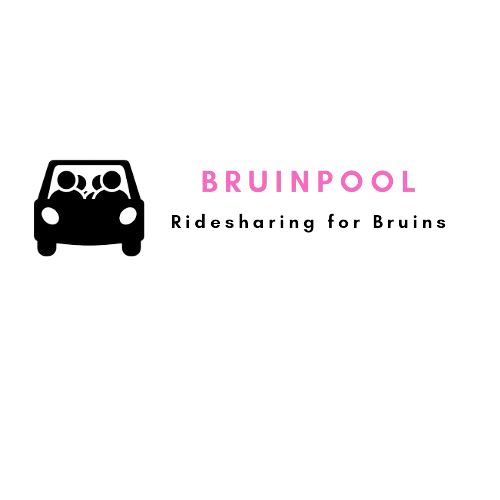

<h1 align="center">
   
  </a>
   
  <b>BruinPool</b>
   
</h1>

  <a href="#about">Development</a> |
  <a href="#development">About</a> |
  <a href="#getting-started">Getting Started</a>

# Development

BruinPool was created as the UCLA COM SCI 35L Project by students Ajay Krishnan, Alan Lin, Arthur Baghdasian, Eric Chakhoyan, and Hakob Atajyan (Discussion 1A). 
We used React.js to build the front-end, as well as Node.js to build the back-end, while storing the databases using MongoDB. 
